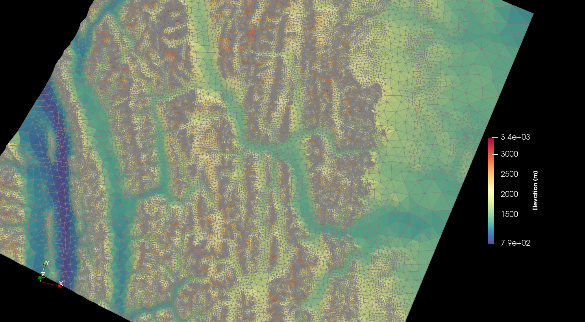
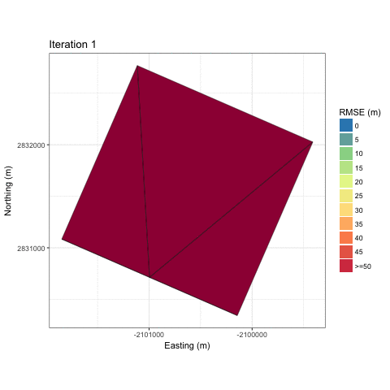

# mesher

Mesher is a novel multi-objective unstructured mesh generation software that allows mesh generation to be generated from an arbitrary number of hydrologically important features while maintaining a variable spatial resolution. Triangle quality is guaranteed as well as a smooth graduation from small to large triangles. Including these additional features resulted in a better representation of spatial heterogeneity versus classic topography-only mesh generation. The paper describing it can be [found here](https://www.usask.ca/hydrology/papers/Marsh,_et_al_2018.pdf).

### Key points
*	A novel multi-objective unstructured mesh generation software, Mesher, is presented
*	Heterogeneity in topography is resolved as well as hydrologically important surface and sub-surface attributes
*	Spatial heterogeneity is better preserved compared to existing mesh generators


An example of a mesh that has been generated to represent topography and vegetation is shown below for the Rocky Mountains around the Bow valley, west of Calgary, Canada. This area is approximate 90,000 km^2 and the mesh has approximately 130k triangles. The mesh is shown with triangle edges coloured in grey, and the faces coloured by elevation. Areas of significant heterogeneity, such as the steep ridge lines and the tree-line, have increased triangle density. Areas with low heterogeneity, such as the valleys, have large triangles. This mesh is currently used for the [SnowCast](http://www.snowcast.ca) product.



## Mesh construction 
Below are two animations that show various snapshots of the in-construction mesh as it is being refined. These correspond to the `gaussian_hill` and `granger` meshes in the `examples` directory. Both meshes used only topgrahy for construction, and thus the triangles are colored based on RMSE (m) to the underlying raster.


Gaussian Hill             |  Granger
:-------------------------:|:-------------------------:
  |  


# Use
Mesher depends heavily upon GDAL to handle the geospatial data and the GDAL python bindings. Mesher's input rasters can be in any 1-band raster that GDAL can open. The triangulation is performed using the Delaunay triangulation code in CGAL. Input rasters need to have a coordinate system.

## Compilation
To compile mesher requires cmake, boost, and cgal. To configure and compile run the following:

```cmake .```

```make -j10```

## Parameter files
Configuration parameters are set in a second ```.py``` file and passed as an argument to `mesher.py` on the command line. For example:


```python mesher.py example_mesher_config.py```

The extent of ```dem_filename``` is used to define the simulation extent, and thus the area that is meshed. Input parameters are clipped to this extent. However, parameters need not cover the entire extent of the simulation domain.

```max_area``` Is a constraint on the maximum size (m^2) of a triangle.

```max_tolerance``` The maximum difference (vertical distance) between the triangle and the underlying raster

```min_area``` A minimum area (m^2) past which mesher should not refine a triangle further. A good setting is the square area of a DEM cell. This does not mean a triangle won't be smaller than this; rather, if a triangle is below this threshold it will automatically be accepted as valid. This will override the tolerance setting. For example, if the threshold is 3m^2, and a 2m^2 triangle is checked for validity, it will automatically be accepted, without checking the tolerance. A triangle may end up smaller than this threshold due to other splitting that occurs in order to guarantee triangle quality.

```errormetric``` Assigned an integer value that determines the error metric to use.
'mean_tol' = Mean elevation difference 
'max_tol' = Max elevation difference
'rmse'  = RMSE tolerance 

```parameter_files``` is a dictionary  that lists additional parameters. Because a triangle may cover more than one raster cell, the ```method``` variable specifies either 'mode' or 'mean'. This controls how the >1 cells are merged and assigned to a triangle. 'Mode' sets the triangle to be the value that is most common out of all cells.

```initial_conditions``` is a dictionary  that lists additional parameters. Because a triangle may cover more than one raster cell, the ```method``` variable specifies either 'mode' or 'mean'. This controls how the >1 cells are merged and assigned to a triangle. 'Mode' sets the triangle to be the value that is most common out of all cells.

For both initial conditions and parameter files, an optional 'tolerance' can be set. If 'method' is 'mode', then this is a fractional percent of the dominate landcover to cover the triangle area to not split the triangle. Otherwise, it is RMSE in the units of the raster's value.

If the input rasters are of different resolutions, then ```min_area``` should be set to approximately 1/4 the size of the coarsest raster. For example, if the DEM is LiDAR at 1m x 1m, and landcover is present at 30m x 30m, then `min_area = 30^2 / 4` is a good starting point. This is to prevent the creation of small triangles along the coarse mesh edge.

```python

def my_classifier(value):
    if value < .98:
        value = 0
    else:
        value = 1
    return value

    parameter_files = {
        'landcover': { 'file' : 'eosd.tif',
                       'method':'mode',
                        'tolerance':0.8
},  # mode, mean
        'svf':{'file':'wolf_svf1.tif',
               'method':'mean',
               'classifier':my_classifier
               }
    }
initial_conditions={
     'sm' : {'file': 'granger_sm_2000.tif', 'method': 'mean'},
    'swe' : {'file': 'granger_swe_2001.tif', 'method':'mean'}
}
```

The classifier allows for reclassifying data within mesher so that data-loss from classifying on a raster is minimized.

Complex basin shapes might result in the creation of many triangles along the complex edges. Thus ```simplify=True``` and ```simplify_tol``` can be used to simplify the basin outline. ```simplify_tol``` is the simplification tolerance specified in meters. Be careful as too high a tolerance will cause many lines to be outside of the bounds of the raster.

```simplify_buffer``` Sets a negative buffer (i.e., contracts the meshing domain) to give ```simplify_tol``` more room to work. That is, usage of the simplify tolerance without this will likely put triangles outside of the valid data domain. Using this allows for the simplification to result in triangles that exist within the data domain. You can disable the use of this buffer by setting ```no_simplify_buffer=True```. ```simplify_buffer``` is enabled by default [defaults to 10m] when ```simplify=True```.

```python
# Configuration file for Mesher
dem_filename = 'bow_srtm1.tif'
max_area=1000000
max_tolerance=50
min_area = 30**2
parameter_files={ }
initial_conditions={ } 
errormetric = 1 
simplify     =   False
simplify_tol =   5   
```

```lloyd_itr``` Enables Lloyd iterations. As per the CGAL documentation: the goal of this mesh optimization is to improve the angles inside the mesh, and make them as close as possible to 60 degrees. 100 iterations is a suggested amount. However, please note this does invalidate the numerical gurantees about the minimum amount of error introduced to the mesh. More details can be found in the CGAL documentation [here](https://doc.cgal.org/latest/Mesh_2/index.html#secMesh_2_optimization).
    
```user_output_dir``` Sets a user-defined output directory instead of the automatically generated folder name.

```use_input_prj``` Use the input file's projection. This is useful for preserving a UTM input. Does not work if the input file is geographic.

```do_smoothing```  Do smoothing of the input DEM to create a more smooth mesh. This can help if the DEM quality is poor or if triangles close to the elevation raster cell size is required.

```smoothing_scaling_factor``` Smoothing factor for above option.

```max_smooth_iter``` Number of iterations to smooth over, each smoothing using cubic spline, and resamples by ```iter * scaling_factor``` for each iteration.

```reuse_mesh``` If a mesh was already generated, and only applying a new parametrization is required, enabling this skips the mesh generation step.


# Outputs

Mesher creates a directory with the same name as the input dem. This directory has the reprojected files (```*_projected```), Triangle's intermediary files (.node, .elem, .neigh), and the triangulation shape file (```*_USM.shp```). A ```*.vtu``` file is also created for visualizing in 3D in [Paraview](http://www.paraview.org).
