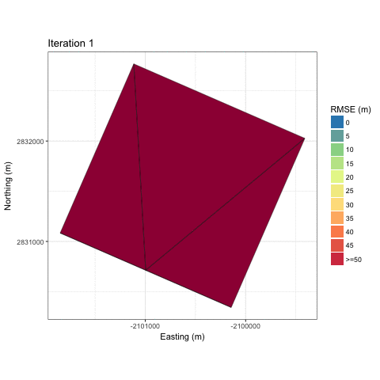
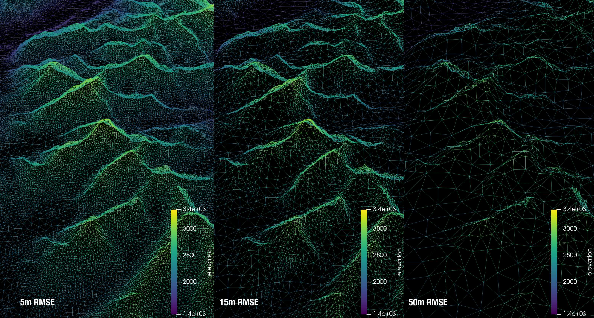
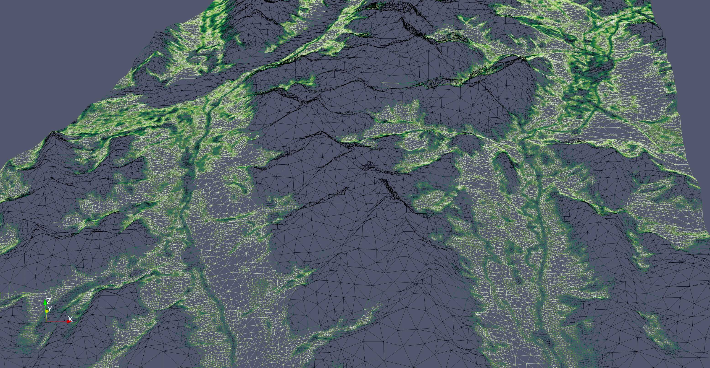

Algorithm
==========
The paper describing mesher can be `found here <https://www.usask.ca/hydrology/papers/Marsh,_et_al_2018.pdf>`_ and is the best description for how the algorithm works. However, a brief summary is given here to help the user understand why certain things behave the way they do.

The basic principal of mesher is to generate an unstructured triangular mesh of irregularly shaped and sized triangles. Specifically, as each triangle can be though of as an interpolant to an underlying surface (e.g., DEM), a triangle will therefore approximate the underlying surface to some degree of precision. The main idea of mesher is to generate meshes with fewer computational elements than a raster for use in a hydrological or landsurface model. Importantly, the heterogeneity in key aspects of the surface must be maintained while doing so.

Triangles (starting very large) are inserted into the triangulation, and all the underlying raster cells that are covered by this triangle are used with an error metric, e.g., root mean squared error (RMSE) to determine if this triangle approximate those raster cells "well enough". "Well enough" is defined by the user as a maximum error tolerance. For example, as user could specify that they wanted a triangle to approximate the underlying raster cells to no more than 5m RMSE. Thus, a triangle is rejected and refined (made smaller) if this tolerance is not fulfilled, i.e., there is too much error introduced. This proceeds for all triangles until all triangles have either a) passed the tolerance or b) the triangle cannot be made smaller, and is accepted.

An example of this iterative refinement of the mesh is shown below for a gaussian hill. 

And an example for the Granger sub-basin

.. image:: images/granger.gif

As the tolerance is made smaller, less error is introduced, and the mesh better approximates the underlying surface. However, the total number of triangles increases. There is therefore a user's choice in balancing the total number of triangles, which will require more computational effort to use in a simulation, versus limiting the total error introduced.

Consider the following three meshes where each has a progressively larger tolerance to approximate a base 30 m SRTM DEM. 

Therefore, with the tight tolerance of 5 m, a generally  uniform distribution of triangle size is created. From a hydrological model's computational standpoint, having a good mix of triangle sizes is best. This ensure heterogeneity where it is required (smaller triangles), e.g. along ridge lines, and larger triangles where it is less needed, e.g., valleys. In this case, the 5 m tolerance is likely a bit too tight, and will result in limited gains over a raster DEM. The 15 m RMSE tolerance produces a good mix of triangle sizes, where the ridge lines are well represented, but the valleys have few triangles. The 50 m preserves key aspects of the topography, such as the ridge lines, but there is a clear smoothing of the mountains

As mesher is designed for use in hydrological landsurface models, using only the topographic information to create the mesh may be insufficient. Capturing important heterogeneities is key. Therefore, mesher uses a multi-objective approach where it will attempt to fulfill tolerances across multiple input rasters. Shown below is such a case where topography and vegetation height were used. Key aspects of the surface such as the tree line and stream (due to the riparian area vegetation) have smaller triangles to capture the spatial heterogeneity, where as on the gentle and mostly uniform slopes has larger triangles.

