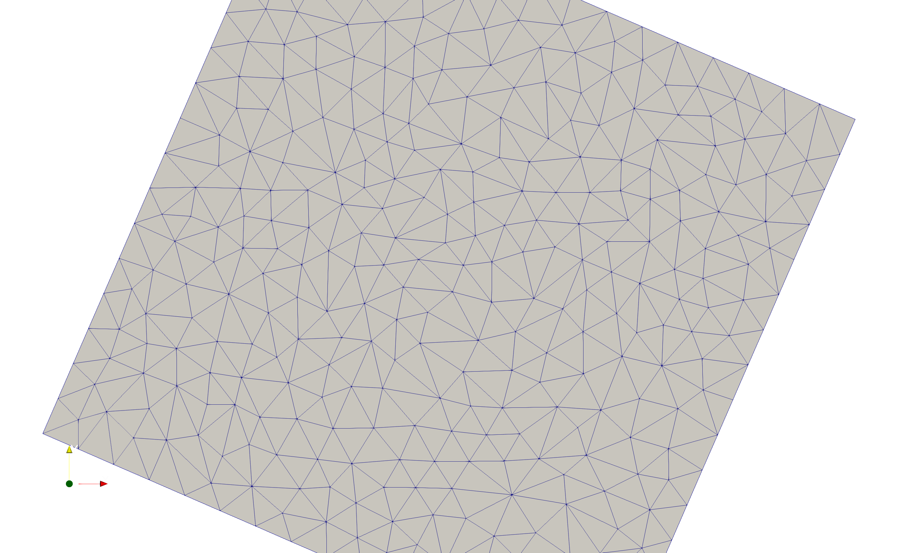
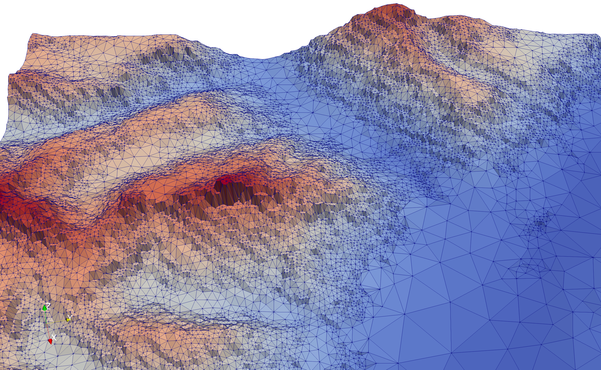
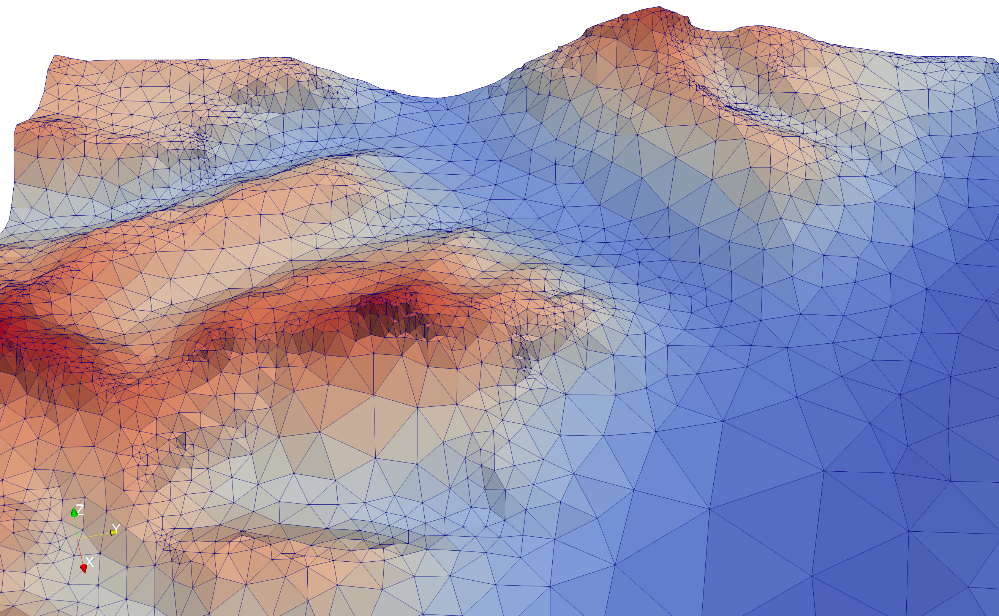
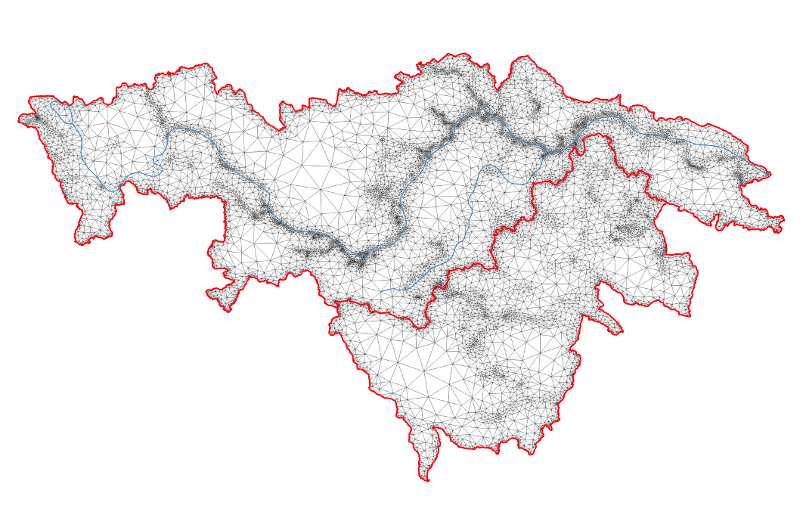

Configuration
--------------

Mesher depends heavily upon GDAL to handle the geospatial data and the GDAL python bindings. Mesher's input rasters can be in any 1-band raster that GDAL can open. Input rasters need to have a coordinate system.

.. note:: 
   Only the items in the `Required`_ section are needed for a valid configuration file. However, most of the power of mesher requires use of the other features.

Required
=========
Configuration files are stored in a python file and passed as an argument to ``mesher.py`` on the command line. For example:
::

   python mesher.py example_mesher_config.py

Therefore this configuration file must be compliant python code, but as such can contain arbitrary python code.
Throughout the configuration file, areas and tolerances are taken to be in metres (m).

A minimum configuration file would be:
::

   dem_filename = '../data/ideal_flat.tif'

   max_area= 9999999**2  #Effectively unlimited upper area -- allow tolerance check to refine it further
   max_tolerance = 5    #1m max RMSE between triangle and underlying elevation
   min_area = 5**2     #triangle area below which we will no longer refine, regardless of max_tolerance
   errormetric = 'rmse'
   mesher_path = '../mesher'

.. confval:: dem_filename

   :type: path

The base DEM to use. Single band raster. The extent of ``dem_filename`` is used to define the area that is meshed. Input parameters are clipped to this extent. However, parameters need not cover the entire extent of the simulation domain. Must have a coordinate system. The coordinate system is used to define the coordinate system of the output mesh. This can be overridden with the ``wkt_out`` option -- see `Coordinate Systems`_.

This DEM can have missing values. In such a case, the domain to be meshed is determined as the largest continuous area. The use of missing values can be used to produce complex and non-rectangular areas. However, the more complex the domain, the greater the number of triangles required along the edge. See ``simplify`` on how to avoid this.

.. confval:: max_area

   :type: double

This is a constraint on the maximum size (m^2) of a triangle. Any triangle that is produce that is above this threshold will be rejected and refined. If you wish to set no upper limit on this, specify some very large number, such ``max_area = 9999999999999999``.

.. confval:: max_tolerance

   :type: double

The maximum difference (vertical distance) between the triangle and the underlying raster as measured by the ``errormeteric``. This can optionally be specified as ``-1`` to skip the tolerance checks, which can be useful in producing uniformly sized triangles.

.. image:: images/mesher_tolerances.png

.. confval:: min_area

   :type: double
   :default: ``pixel_width * pixel_height``

A minimum area (m^2) past which mesher should not refine a triangle further. A good setting is the square area of a DEM cell. This does not mean a triangle won't be smaller than this; rather, if a triangle is below this threshold it will automatically be accepted as valid. This will override the tolerance setting. For example, if the threshold is 3m^2, and a 2m^2 triangle is checked for validity, it will automatically be accepted, without checking the tolerance. A triangle may end up smaller than this threshold due to other splitting that occurs in order to guarantee triangle quality. 

.. note::
   Although there is a default value for this, it really should be specified with a value that makes sense.

.. confval:: errormetric

   :type: string

Assigned an string value that determines the error metric to use.

'mean_tol' = Mean elevation difference 
'max_tol' = Max elevation difference
'rmse'  = RMSE tolerance 

The RMSE produces the best distribution of triangle sizes and does not penalized individual raster cells like ``max_tol`` does. RMSE should generally be used.

.. confval:: mesher_path

   :type: string

The ``mesher.py`` script needs to know where the backend mesher executable is located. Optionally use the MESHER_EXE environment variable.

.. confval:: nworkers

    :type: int
    :default: Number of physical CPUs

Mesher will use the number of physical CPUs to parallel various tasks. This allows for fine-tuning that parameter.

.. confval:: nworkers_gdal

    :type: int
    :default: Number of physical CPUs

The initial step where all input parameters and initial conditions are made resampled and clipped to the input DEM
extent can be memory heavy. Therefore this limits, separate from the number of workers for the main parameterize loop,
how many parallel workers should be used to limit memory consumption.

Environment variables
=====================
.. confval:: MESHER_EXE
   
   :type: string

Instead of specifying a ``mesher_path`` in the configuration file, the environment variable ``MESHER_EXE`` may be set to the binary. If both ``MESHER_EXE`` and ``mesher_path`` are defined, the configuration file path takes precedence.

.. confval:: MESHER_NWORKERS

    :type: int

Specifies number of CPUs to use for parallel tasks. This will override a configuration file ``nworkers`` value.

.. confval:: MESHER_NWORKERS_GDAL

    :type: int

Specifies number of CPUs to use for parallel gdal tasks. This will override a configuration file ``nworkers_gdal`` value.

.. confval:: GDAL_CACHEMAX

    :type: string

GDAL's raster I/O functionality will, by default, cache reads and writes by up-to 5% of total memory to increase efficiency.
When dealing with large rasters and parallel processing, this can result in out-of-memory errors. For example, 32 processes
can cache 160% of total available RAM. By default, mesher will internally set the parallel processing cache to be no more
than ~30% of total RAM shared across all processes. This is about ~1% per process. For most systems this gives a good
blend of performance and memory use. However, if out-of-memory situations occur, try setting this lower or to 0. More information
can be found `on the gdalwarp documentation <https://trac.osgeo.org/gdal/wiki/UserDocs/GdalWarp#WarpandCacheMemory:TechnicalDetails>`_
and `wiki page <https://trac.osgeo.org/gdal/wiki/ConfigOptions#GDAL_CACHEMAX>`_.

Lloyd iterations
================

.. confval:: lloyd_itr

   :type: int

Enables *n* Lloyd iterations. As per the `CGAL documentation <https://doc.cgal.org/latest/Mesh_2/index.html#secMesh_2_optimization>`_: the goal of this mesh optimization is to improve the angles inside the mesh, and make them as close as possible to 60 degrees. 100 iterations is a suggested amount. However, please note this does invalidate the numerical guarantees about the minimum amount of error introduced to the mesh.

.. |lloyd| image:: images/lloyd.png
   :width: 100%
   :align: middle

+-------------+
|  No Lloyd   | 
+-------------+
| |no_lloyd|  | 
+-------------+
|   Lloyd     | 
+-------------+
|   |lloyd|   | 
+-------------+

.. confval:: verbose
   
   :type: boolean
   :default: False

Enables verbose output

Outputs
========
.. confval:: user_output_dir

   :type: path

Sets a user-defined output directory instead of the automatically generated folder name.

.. confval:: reuse_mesh 

   :type: boolean
   :default: False

 If a mesh was already generated, and only applying a new parametrization is required, enabling this skips the mesh generation step.

.. confval:: write_shp
   
   :type: boolean
   :default: True

Writes a .shp file corresponding to the produced triangulation. Is an expensive operation and can slow down production of very large meshes with many parameters.

.. confval:: write_vtu

   :type: boolean
   :default: True

Write a .vtu file that can be view in Paraview. 

Coordinate systems
===================

By default mesher uses the coordinate system of the DEM as the output mesh's coordinate system. 

.. confval:: use_input_prj 

   :type: boolean
   :default: True

Use the input file's projection. This is useful for preserving a UTM input. 

.. confval:: wkt_out
   
   :type: string

The output coordinate system can be set using this variable. This needs to be in well known text (wkt) format, e.g.,
::

    wkt_out = "PROJCS[\"North_America_Albers_Equal_Area_Conic\"," \
              "     GEOGCS[\"GCS_North_American_1983\"," \
              "         DATUM[\"North_American_Datum_1983\"," \
              "             SPHEROID[\"GRS_1980\",6378137,298.257222101]]," \
              "         PRIMEM[\"Greenwich\",0]," \
              "         UNIT[\"Degree\",0.017453292519943295]]," \
              "     PROJECTION[\"Albers_Conic_Equal_Area\"]," \
              "     PARAMETER[\"False_Easting\",0]," \
              "     PARAMETER[\"False_Northing\",0]," \
              "     PARAMETER[\"longitude_of_center\",-96]," \
              "     PARAMETER[\"Standard_Parallel_1\",20]," \
              "     PARAMETER[\"Standard_Parallel_2\",60]," \
              "     PARAMETER[\"latitude_of_center\",40]," \
              "     UNIT[\"Meter\",1]," \
              "     AUTHORITY[\"EPSG\",\"102008\"]]"

Domain simplification
======================

.. confval:: simplify

   :type: boolean
   :default: False

As described in the `algorithm <algorithm.html>`_ section, the input DEM defines the area to be meshed. If no-data values are present, then the largest continuous area defines the area to be meshed. As a result, complex basin shapes will likely result in the creation of many triangles along the complex edges. This option can  be used to simplify the basin outline. Setting ``simplify`` to ``True`` requires setting a value for ``simplify_tol``.

Once the domain to be meshed is determined (and is represented by a polyline), this polyline is simplified so-as to have no more than ``simplify_tol`` meters of error. By default will enable ``simplify_buffer``. See ``no_simplify_buffer``.

Can only be used with a ``wkt_out`` that is a projected CRS.

.. confval:: simplify_tol

   :type: double
   :default: 10 m

The maximum error (m) the polygon simplification of ``simplify`` can introduce. Be careful as too high a tolerance will cause triangles to be crated that are outside of the bounds of the raster.

.. confval:: simplify_buffer

   :type: double
   :default: -10 m

Sets a negative buffer (i.e., contracts the meshing domain) to give ``simplify_tol`` more room to work. That is, usage of the simplify tolerance without this will likely put triangles outside of the valid data domain. Using this allows for the simplification to result in triangles that exist within the data domain. You can disable the use of this buffer by setting ``no_simplify_buffer=True``. ``simplify_buffer`` is enabled by default when ``simplify=True`` is given.

.. confval:: no_simplify_buffer

   :type: boolean
   :default: False

Disables ``simplify_buffer`` when ``simplify=True``

.. confval:: extent

   :type: list[4]
   :default: []

A large DEM may be subset to ``[xmin ymin xmax ymax]``. These are given in the coordinate system of the input DEM.

.. confval:: clip_to_shp

   :type: str
   :default: None

A large DEM may be clipped to the geometry specified by a shape file. This should be a path to the shape file e.g., `/my/path/geom.shp'. The shp must be georeferenced and will be reprojected by gdalwarp as required.

Domain Repair
==============

.. confval:: fill_holes

    :type: boolean
    :default: False

A 1-pass of the GDAL `fill no data <https://gdal.org/programs/gdal_fillnodata.html>`_ algorithm. Maximum search distance is defined as ``max([pixel_height, pixel_width]) * 5``.

Input DEM smoothing
====================

If the DEM quality is poor or if triangles close to the elevation raster cell size is required. If the ``min_area`` is approximately equal to the cell size of the raster and tolerance parameter ensures triangles of this size are being produced, then in complex terrain the stair stepping of the raster (due to non-continuous first derivative; i.e., slope) impacts the mesh quality as shown below.

Repeated smoothing iterations can be done. Each smoothing iteration using cubic spline and resamples by ``iter * smoothing_scaling_factor``.

 This is the result of 1 smoothing iteration. 

This is the result of 2 smoothing iterations. 

.. confval:: do_smoothing 

   :type: boolean
   :default: False

Smooths the input DEM. 

.. confval:: smoothing_scaling_factor 

   :type: double
   :default: 2.0

 Smoothing factor for above option.

.. confval:: max_smooth_iter 

   :type: int
   :default: 1

 Number of iterations to smooth over. Each iteration the smoothing magnitude increases by ``iteration * smoothing_scaling_factor``.

Parameters
===========

Parameters, such as vegetation cover, flow accumulation, or soils, can be used in mesher in two ways: 1) have their values assigned to a triangle or 2) also constrain the mesh generation, such as shown with the vegetation heights shown on the `algorithm <algorithm.html>`_ page.

No constraint
*************

Parameters are given by key-value pairs in a dictionary, where ``value`` is a dict that contains a file name and an aggregation method:
::

   parameter_files = { 'param_name' : {'file':'file.tif','method':'mean'}}

For example:
::

   parameter_files ={ 
      'soils' : {'file':'/path/to/soils.tif','method':'mean'},
      'canopy_height' : {'file':'/path/to/veg.tif','method':'mean'}
      }

.. confval:: param_name

   :type: string

This is the name of the parameter as it will appear in the final mesh output. I.e., what you want this to be called for use in a model.

.. confval:: file
   
   :type: string

This is a fully qualified path to the raster file

.. confval:: method

   :type: string
   :default: 'mean'

The method controls how the various raster cells that make up the triangle are combined together to give. One of ``mode`` or ``mean`` (``average`` works too). The ``mean`` is the mean of all values, whereas ``mode`` takes the value that has the greatest number of cells. The ``mode`` is good for classified data, such as soil or vegetation type.

Optionally, ``method`` may be a user-specified function that accepts a numpy array and returns one value.

.. confval:: do_cell_resize
   
   :type: bool
   :default: true

Mesher will resize the cells of a raster to match the input DEM's resolution. However this can result in producing a lot of small triangles around a coarse raster's cells if a tolerance for this raster is set. For example, if using a coarse vegetation class with a high resoution DEM, it can produce a lot of edge triangles around the vegetation classes. Therefore, if a tolerance on a parameter layer is set, then ``do_cell_resize=False`` is automatically set.

.. confval:: drop

    :type: bool
    :default: false

Some parameters may be used to constrain the mesh during generation but a user may not want it written to file. Setting ``drop=True`` will not write this parameter to file.

Classifier
**********

A user-specified function can be given as a classified function. This allows, after the ``method`` function has combined all the rasters into a single value for the triangle, to re-value this value. This function takes 1 value, and returns 1 value. It is called **after** the ``method`` function is called.

For example, perhaps a vegetation density metric as derived from remote sensing is to be converted to a canopy height. This could be done as:
::

   def Tree_cover_2_VegHeight(value):
       if value >= 50:
           value = 10 # set the tree hight to 10 m
       else:
           value = 0.1 # otherwise set low density to open
       return value

   parameter_files ={'CanopyHeight': {'file':'60N_120W_treecover2010_v3.tif',
                                       'method':'mean',
                                       'classifier':Tree_cover_2_VegHeight
                                       }
                     }

Alternatively, a binary tree/no-tree parameter could be derived
::

   def Tree_cover_2_Simple_Canopy(value):
       if value >= 50:
           value = 0 # not open
       else:
           value = 1 # open
       return value

  parameter_files ={ 'landcover': {'file':'60N_120W_treecover2010_v3.tif',
                                    'method':'mean',
                                    'classifier':Tree_cover_2_Simple_Canopy
                                  } }

Multiple input rasters can be combined in to a single parameter using a more complex classifier. This works by passing ``file`` and ``method`` a list of length *n* of the files and aggregation methods. The classifier then takes *n* arguments and returns a singlge value. The following examples shows using a water mask and a landcover map to make a water/open/treed dataset.
::

   def make_landcover(water,veg):
     if water == 1:
       return 0 #keep it water

     if veg < 0.2:
       return 1 #this will be clearing/open

     return 2 # this is tree cover

   parameter_files = { 'landcover':{'file':['waterMask.tif','Simard_Pinto_3DGlobalVeg_L3C.tif'],
                                    'method':['mode','mean'],
                                    'classifier':make_landcover}}

Using as constraint
*******************

By setting an optional ``tolerance`` value in the dictionary, a raster can be used to constrain the mesh generation. If ``method`` is ``mode``, then this is a fractional percent of the dominate cell values to cover the triangle area. Otherwise, it is RMSE in the units of the raster's value.

For example:
::

   parameter_files ={ 
      'soils' : {'file':'/path/to/soils.tif','method':'mean','tolerance':0.6},
      'canopy_height' : {'file':'/path/to/veg.tif','method':'mean','tolerance':2}
      }

Assuming the soils raster is a classification map, then each triangle must have 60% of one soil type **as well as** be within 2 m RMSE to the canopy height.

Any number of rasters may have a tolerance. Further, if used with a user-defined classifier, then the tolerance check occurs after the classifier has run

.. note::
   As more tolerances are added, or tolerances become tighter, more and more triangles will be produced. Past a certain point, it does not become meaningful to use an approximating mesh!  

Initial conditions
===================

Initial conditions work exactly the same way as paramters. However, they are written to a seperate file than the parameters and are intended to be used as intial conditions in a numerical model. They may be used to constrain the mesh.

::

   initial_conditions = { ... }

Shape file constraints
=======================

Shape files may be used to further constrain the mesh, for example to rivers or basin outlines. The line segments in the shape file are treated as barries that triangles cannot cross; thus triangle edges represent the shapefile edges exactly. It may be benificial to simplify these edges somewhat so-as to avoid the creation of many small triangles.

This is further shown in :ref:`examples:flat_stream`.

::

   constraints = { 'river_network' :
                  {
                     'file': '../data/Stream.shp'
                     'simplify':1 # will be in shp file's original units
                  }
            }

.. confval:: constraints.keyname.simplify

   :type: double

Amount to simplify the shapefile edges by. Measured as maximum error between old and new lines. In the units of the shp file.

