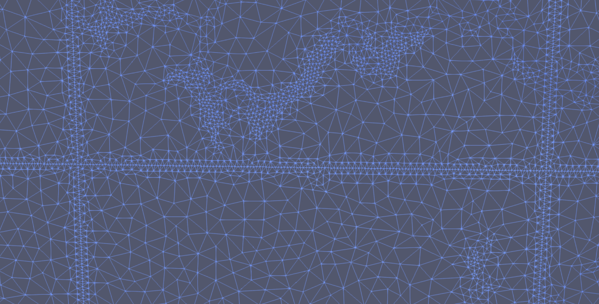
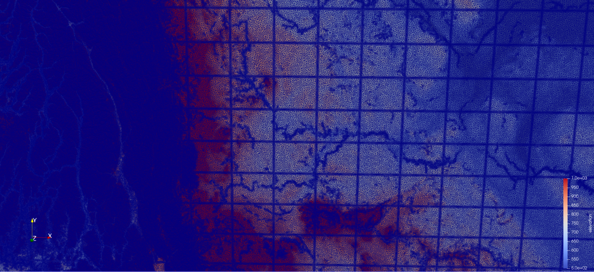

MPI
-----

Mesher can use MPI to regularize the input rasters in parallel,
and to do the regridding of the parameter rasters to the triangles. Mesher can also do a type of parallel mesh
generation. A few considerations about this are described below.

Mesher will invoke the MPI processes itself
++++++++++++++++++++++++++++++++++++++++++++++++

The main mesher application is single process and mesher will invoke the MPI sub-tasks itself. By default,
MPI Spawn will be used. This is only supported with OpenMPI and assumes that mesher is running in a context where
it makes sense to spawn MPI ranks (e.g., HPC job).  In constrained HPC context, it may be better to have the main
mesher process running in a small job and spawn MPI sub-jobs in dedicated jobs. This is where ``MPI_exec_str`` is used.
``MPI_exec_str`` can be a job submission script. Using the MPI spawn can sometimes not work, so setting
``MPI_exec_str=f'mpirun -n {MPI_nworkers} python '`` may be preferred.

Mesh seam
+++++++++++

The mesh generator is, by default, serial. For large meshes, this can be very slow. Enabling multiple MPI workers
will split the domain into subdomains and mesh each subdomain independently. The subdomains are ensured to line up by
placing points along the seam, approximately spaced at the smallest allowed triangle size. This can be controlled with
``mpi_shared_edge_spacing``. Setting a lower density can ensure this boundary seam is not over reprsented, but the
triangles may not be strictly Delaunay while crossing the boundary. This can result in a regular pattern of small
triangles. This is more evident in areas with low topographic variability than in areas with high variability.

Zoom in of a seam

|image0-mpi|

|image1-mpi|

lloyd iterations
++++++++++++++++++
Global lloyd iterations breaks the alignment across the seams.

MPI mesh gen
+++++++++++++

To do the triangulation in parallel, ``mpi_mesh=True`` must be set.

