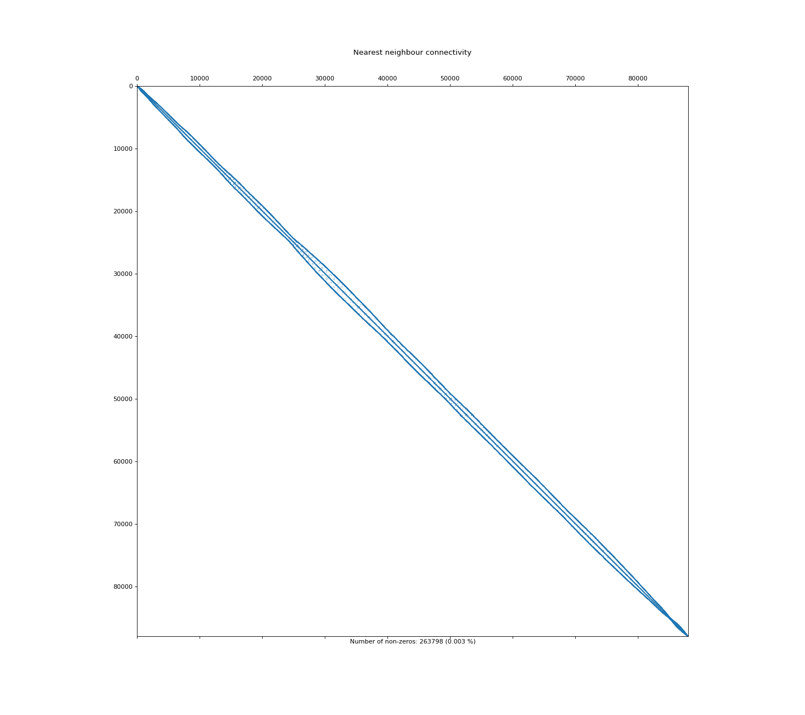

Tools
=======

mesh2vtu.py
***********

Combines and converts a ``.mesh`` file and a ``.param`` file into a corresponding ``.vtu`` file

Usage:
::

   mesh2vtu.py input.mesh input.param output.vtu

meshmerge.py
*************

Combines multiple parameter files (``.param``) into one. All the files are validated to ensure each parameter has the same number of elements.

Usage:
::

   meshmerge.py [-h] [-o outfile] infile [infile ...]

.. confval:: infile

   :type: string

Path to the *n* input parameter files to merge into one

.. confval:: outfile

   :type: string

Optional path to the output parameter file. If not given, defaults to a filename of concatenated input files.

meshpermutation.py
*******************
Because of how the triangles are generated and subsequently written to file, triangles that are close in space may not be close in the file. Therefore, if the mesh is used in a numerical model, it may result in inefficient access. This tool computes the permutation of a mesh that minimizes the bandwidth of the connectivity matrix. 

This tool adds a new field ``cell_global_id`` to the ``.mesh`` file. A consuming program can sort the triangles (i.e., ``mesh.elem`` see: :ref:`output:.mesh`) by these ids. Then, spatially close triangles will also be close in memory. This may be visualized by plotting the nearest neighbour connectivity before and after reodering.

**Before optimization**

.. image:: images/orig_order.png

**After optimization**

Usage:
::

   meshpermutation.py [-h] [-o outfile] [-t type] [-i infile]

.. confval:: outfile

File for output. Overwrite input file

.. confval:: type

``rcm`` Performing RCM bandwidth minimization (default)

``nd`` Performing ND fill-in minimization

``metis`` Performing METIS communication minimization partitioning. Requires ``-n <value>`` where ``<value>`` is the number of partitions. If this mesh is used later for MPI simulation, this should correspond to the number of MPI ranks that will be used.

.. confval:: n

If ``metis`` type is selected, this is required. Number of partitions.

meshstats.py
*************

Produces a csv file of detailed per-triangle information: the error ('rmse' is computed), triangle area (units^2), min and max inner angles (degrees).
These values are also written to the ``_USM.shp`` file in the mesher output directory.

Expects that the ``.mesh`` is in a projected CRS.

Note that the triangles' RMSE is recomputed, so can be a bit slow on very large meshes.

.. note::

   Requires ``write_shp=True`` as the shp file is used to load triangle geometry. 

Usage:
::

   meshstats.py dir 

.. confval:: dir

Directory to output directory produced by mesher.

