This folder contains a variety of validation datasets and _mesher_ inputs. There should be a symbolic link in this directory to the location of the mesher build. I.e.,
```
ln -s ~/path/to/build/of/mesher/bin/Release/mesher mesher
```

## flat
Flat DEM, produces 2 triangles

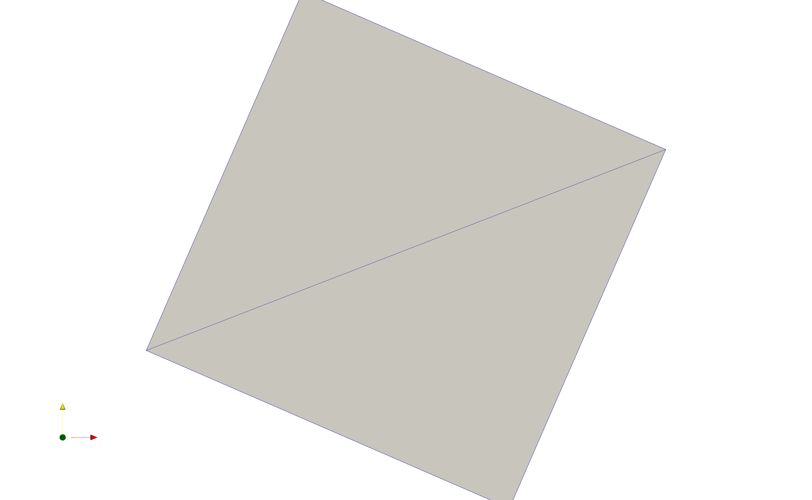

## flat_veg
Uses the EOSD dataset to mesh with a `mode=0.9` threshold. This captures most of the vegetation patches. ALthough it result in an over-generation of triangles between patches, this is due to producing a good gradation from small to larger triangles. 

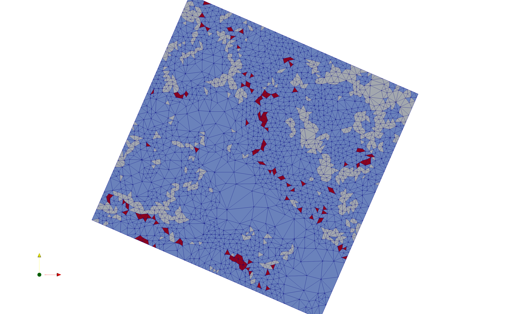

## gaussian_hill
Using the generated gaussian hill dataset, produces a mesh for a guassian hill. 

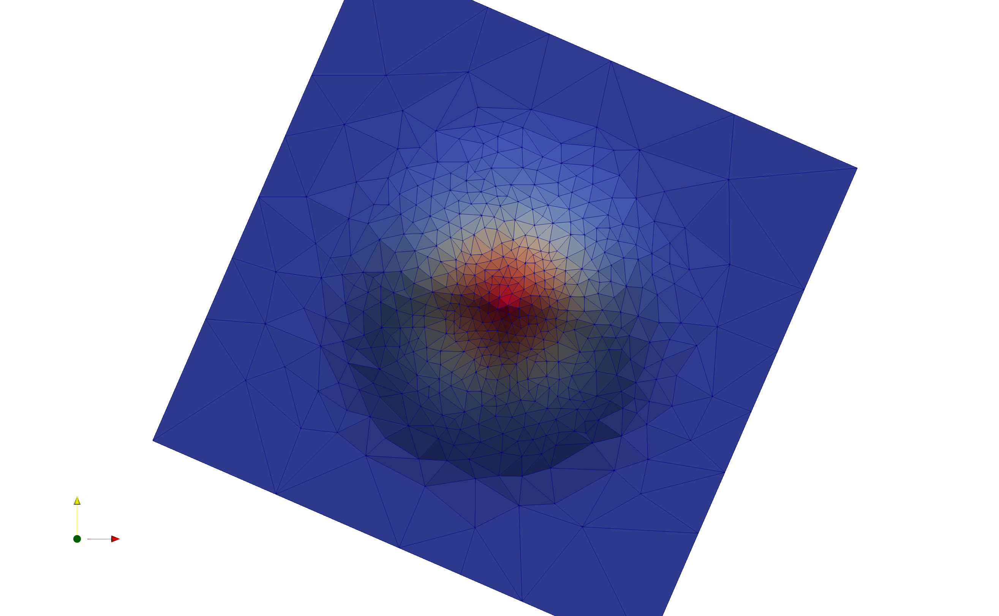

## ideal_ridge
An idealized ridge line

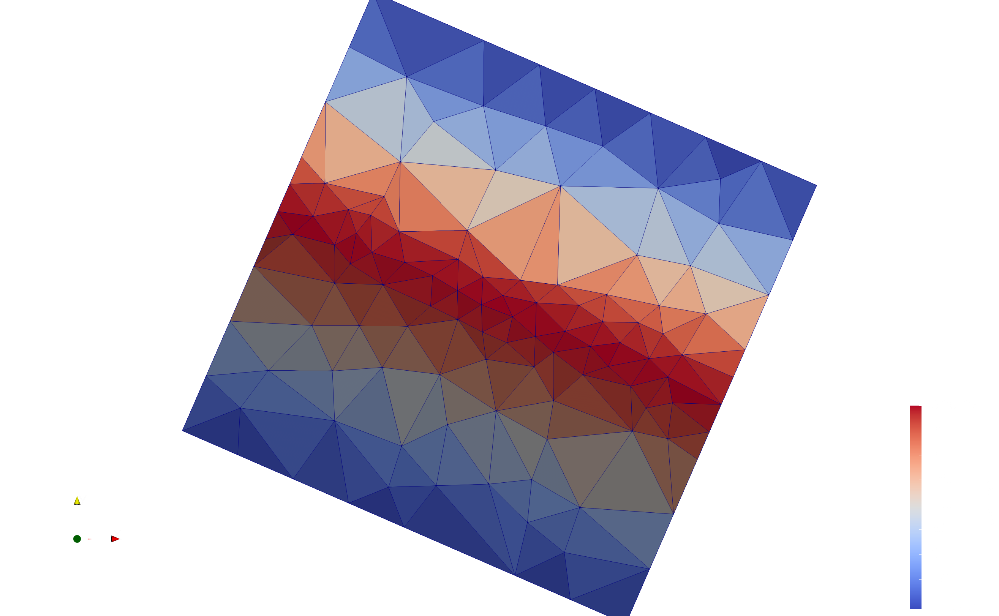

## ideal\_ridge\_low\_tol
Same as the ideal_ridge, but with a lower tolerance. Produces more triangles along the rige to better capture it.

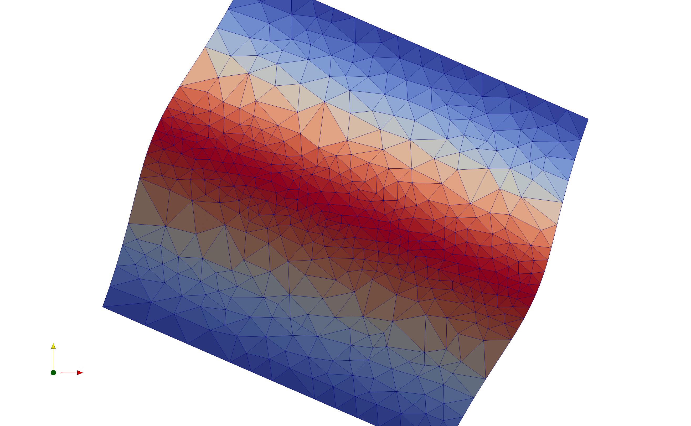

## uniform
Produces a uniform mesh with area = 100 m x 100 m.


## lloyd
Demonstrates the impact of 100 [lloyd optimization](https://doc.cgal.org/latest/Mesh_2/index.html#secMesh_2_optimization) iterations on the above uniform domain. Compare to the uniform case
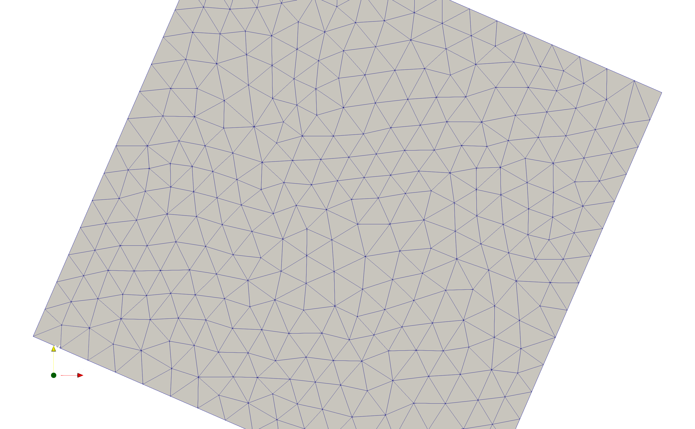

## flat_stream
The flat DEM has been constrained to a stream network input as a shape file. This shows the greater number of triangles near the stream. Simplified stream networks produce fewer triangles along the river constraint.

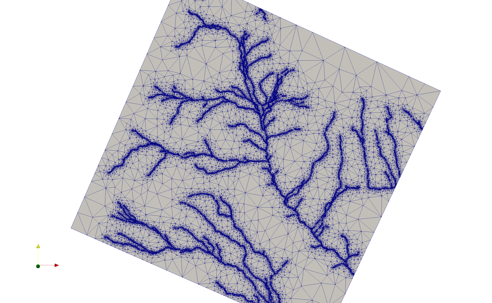

## stream_dem
Same as above, but including the the Granger subset DEM.
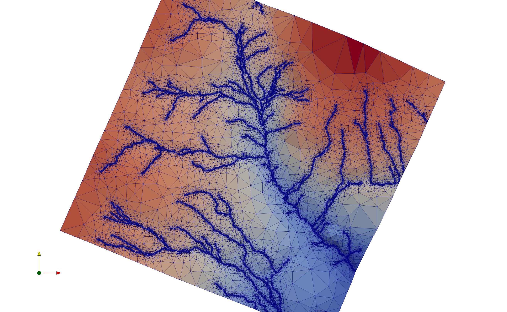

## granger
The Granger subset is used only the elevation map.


## granger\_low\_veg\_weight
The granger subset is used  with a low elevation tolerance plus low weights on the vegetation map, showing mesher mostly ignoring the vegetation constraints. 

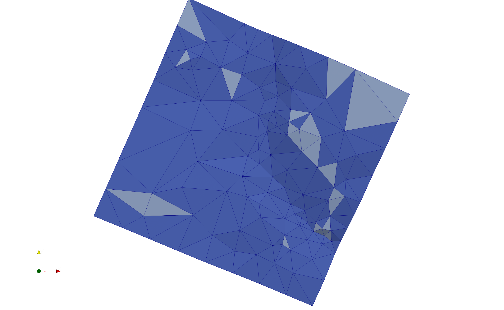

## granger\_high\_veg\_weight
Same as above but with high weight on the vegetation map, showing the algorithm refining triangles to capture the vegetation patches.

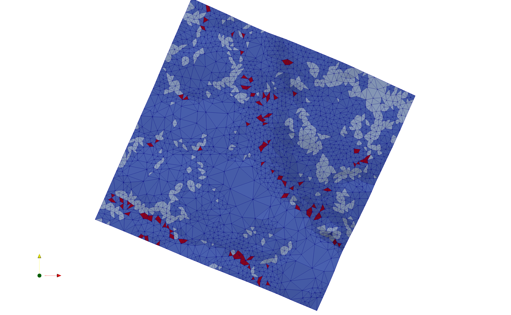

## flow_accumulation
This domain shows large-extent meshing with a mountain domain for the Bow Valley region near Canmore, Alberta, Canada. This mesh uses a DEM-derived flow accumulation via [RichDEM](https://richdem.readthedocs.io/en/latest/flow_metrics.html#d-tarboton-1997) to ensure the mesh captures the high-accumulation locations. The flow accumulation input is generated with the `flow.py` script in `data` folder. This requires the RichDEM Python package [to be installed](https://richdem.readthedocs.io/en/latest/using_it.html).

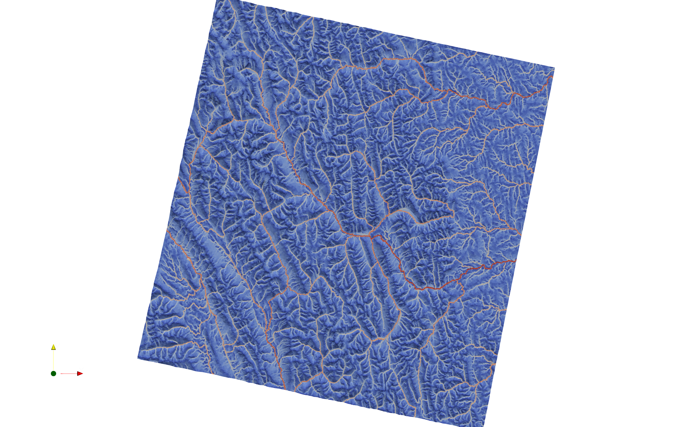

## dem_smoothing
A small subset of the above Bow Valley domain is extracted to show the impact of smoothing on the output mesh. If the `min_area` is approximately equal to the cell size of the raster and tolerance parameter ensures triangles of this size are being produced, then in complex terrain the stair stepping of the raster (due to non-continous first derivative; i.e., slope) impacts the mesh quality as shown below.

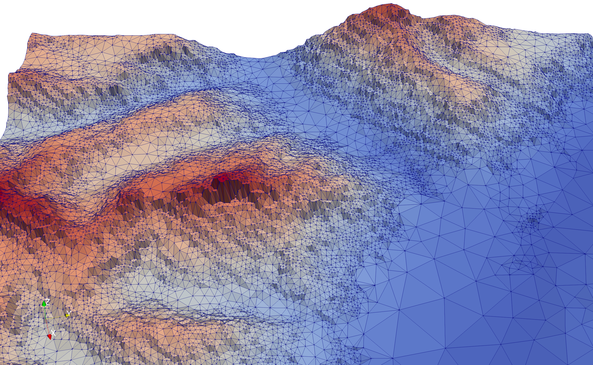

mesher has an option to smooth the input DEM to lessen this impact. This is enabled via

```
do_smoothing = True
max_smooth_iter = 1
smoothing_scaling_factor = 1
```
Each iteration the smoothing magnitude increases by `iteration * smoothing_scaling_factor`. This is the result of 1 smoothing iteration.
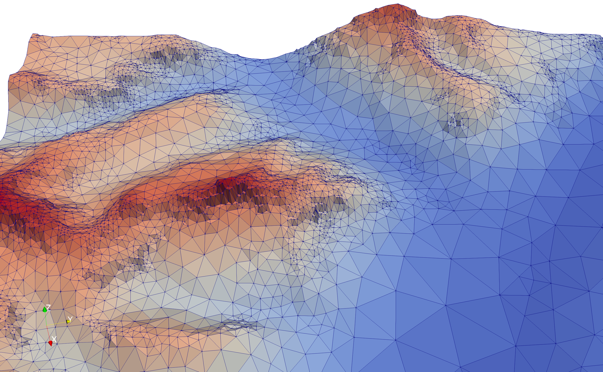

Subsequent iterations, or increases in `smoothing_scaling_factor` can reduce the stair-stepping further at the cost of increased smoothing of complex terrain.

```
do_smoothing = True
max_smooth_iter = 2
smoothing_scaling_factor = 1
```

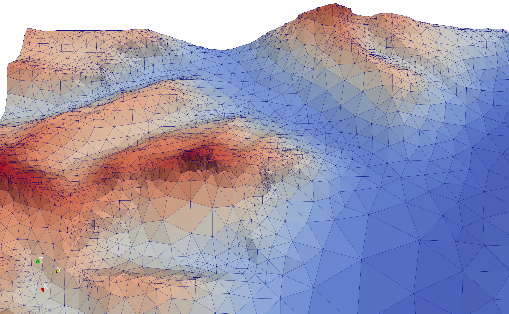
